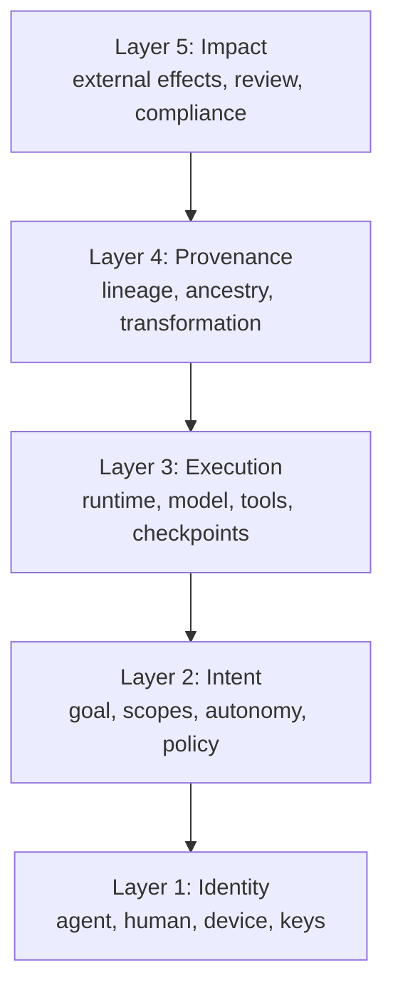
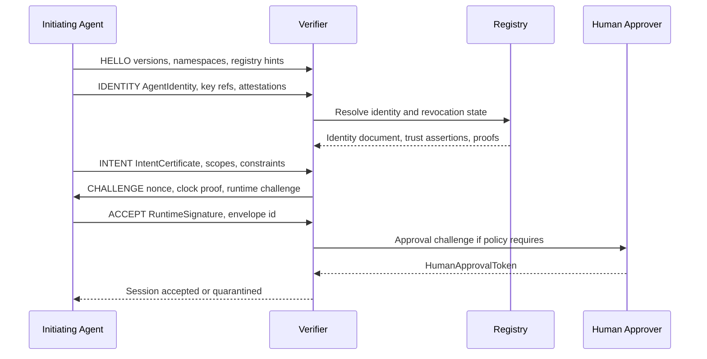
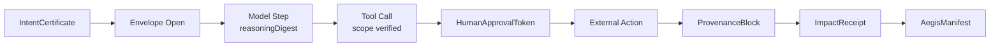
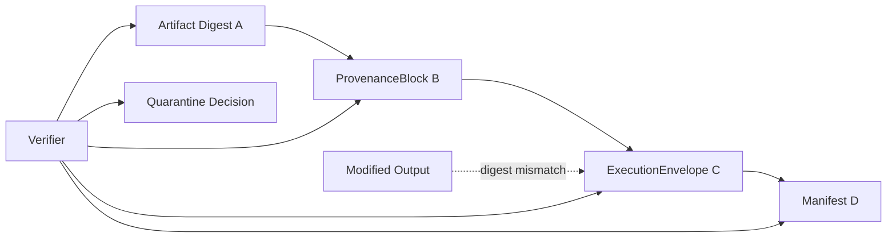
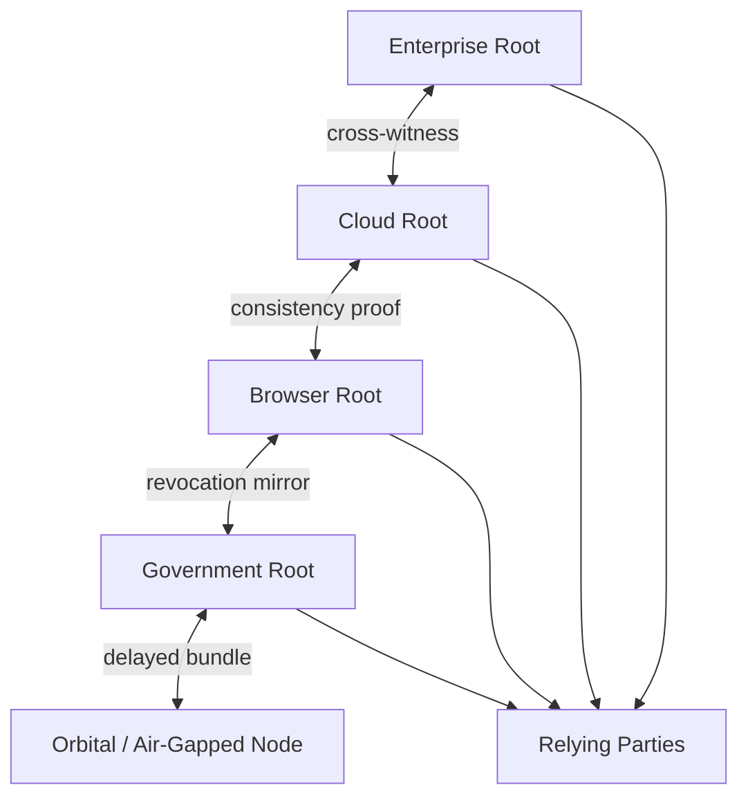

# Protocol Diagrams

These diagrams are non-normative, but they define the expected mental model for implementers.

## Layer Model

## Agent Handshake

## Execution DAG

## Tamper Detection

## Federated Registry Reconciliation

